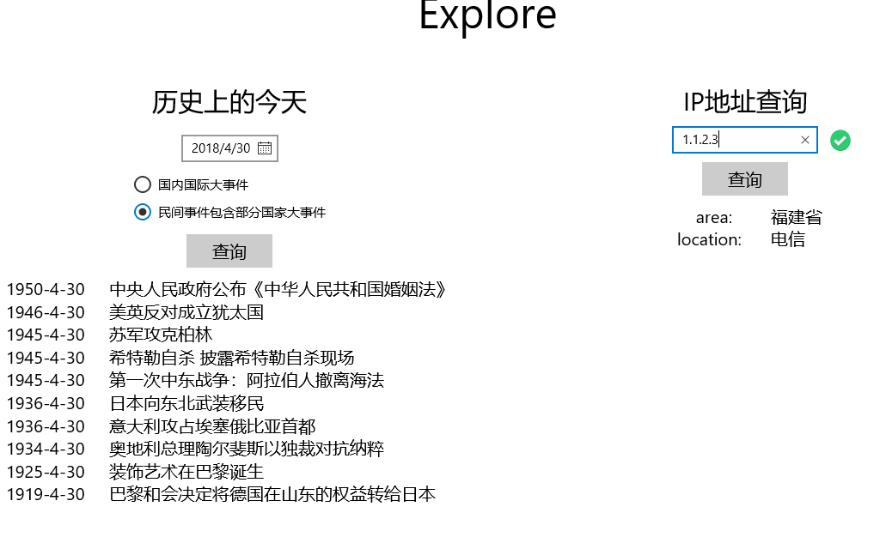

# MOSAD

现操作业

## UWP

### ToDo List
using SQLite.

### HTTPRequest（Explore）

水

### 音乐播放器（Muyer）

水

### PasswordBox

项目地址：[PasswordBox](https://github.com/huangyt39/UWP-midterm)

彩蛋：

## cocos-2dx

都是简单游戏，截图略

### helloCocos

起手项目

### GoldMiner

使用动画

### bhxy2

事件，回调

### Thunder

简单打飞机

### BreakoutClone

简单打砖块

### NetworkAccess/hotUpdate

网络访问/简单热更新

### Dragon!Dragon!Dragon!

期末项目，基于Flappy Bird